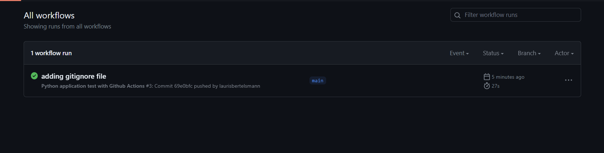

# udacity-devops-project2

## Workflow run success screenshot
 

##An overview of the project

## Architectural Diagram

## Instructions for running the Python project
## A short description of how to improve the project in the future
## Screenshots demonstrating key steps
