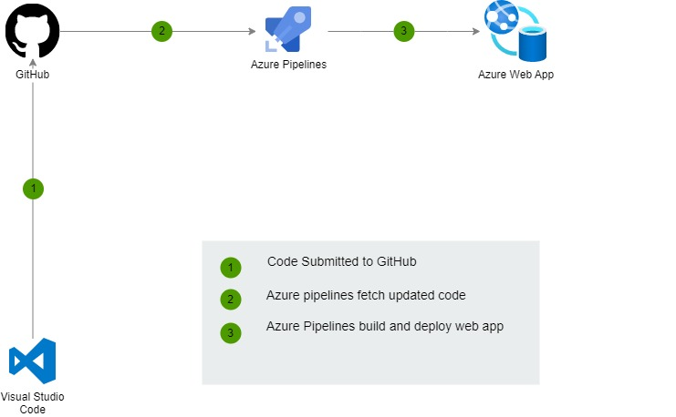
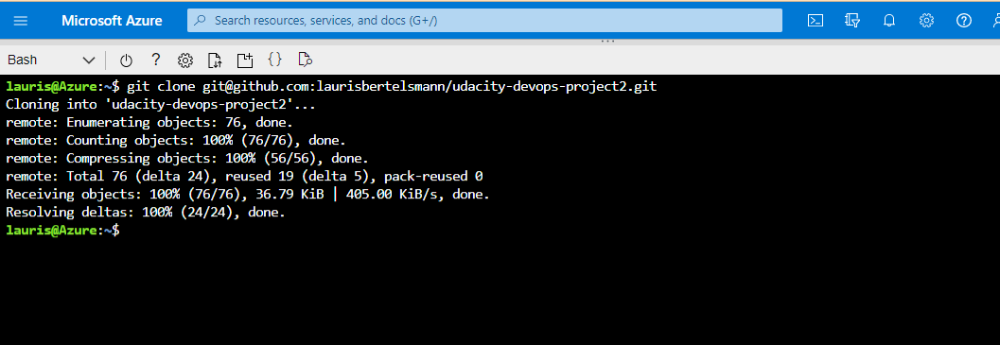
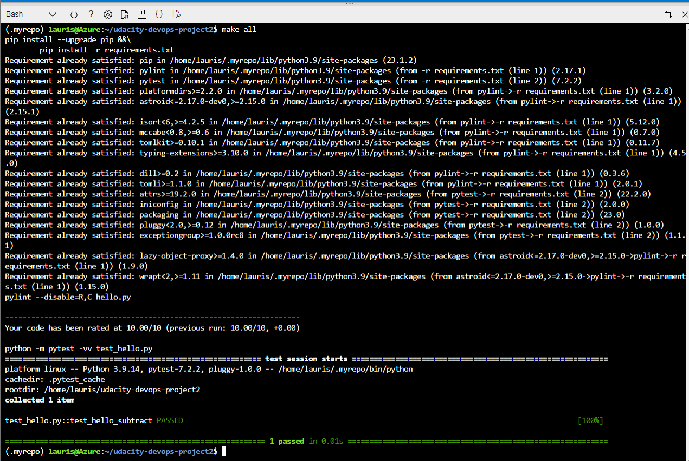
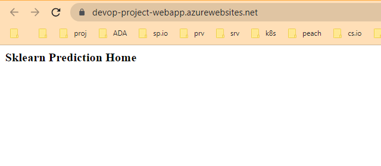
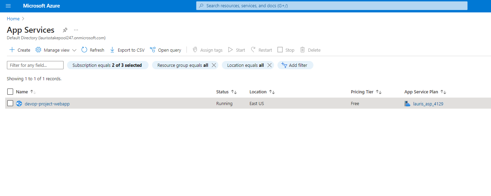
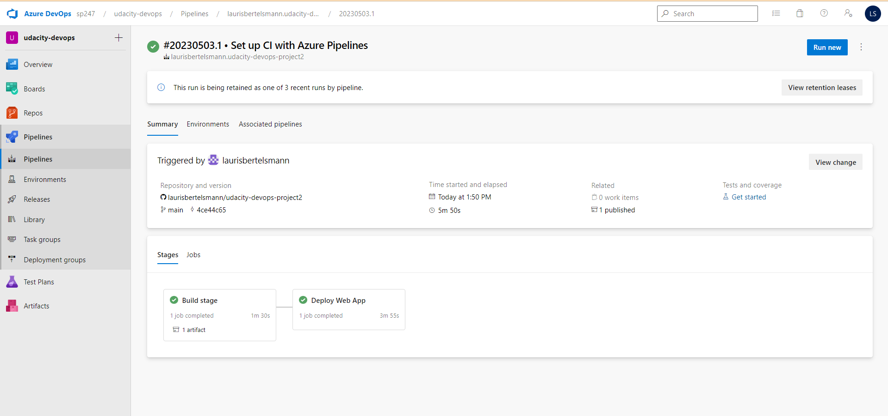
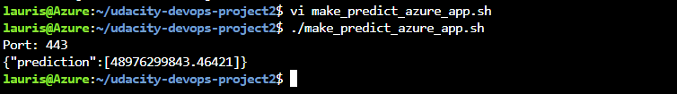
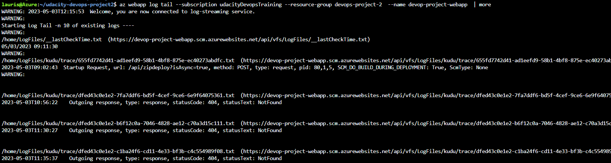

[](https://github.com/laurisbertelsmann/udacity-devops-project2/actions/workflows/pythonapp.yml)

# Overview

Overview of the project
This project is part of the Udacity Azure DevOps Nanodegree. In this project, we will build a CI/CD pipeline for a Python-based machine learning application, deploying the application using Azure Pipelines to Azure App Services. We will also create, publish, and consume a pipeline artifact.

## Project Plan
<TODO: Project Plan

* A link to a [Trello board for the project](https://trello.com/b/n4r8Abx5/devops-project-2)
* A link to a spreadsheet: https://docs.google.com/spreadsheets/d/14l1ZD6s1Z1uvC4zLDvQKN5iocVrHxU8WdQuhBJMaBxM/edit?usp=sharing

## Instructions

  
# Architectural Diagram 
 

<TODO:  Instructions for running the Python project.  How could a user with no context run this project without asking you for any help.  Include screenshots with explicit steps to create that work. Be sure to at least include the following screenshots:

* Clone into Azure Cloud Shell
```bash
git clone  https://github.com/laurisbertelsmann/udacity-devops-project2 
```
you shold have something like this:


Checking tests 
```bash
make all
```
Output of a test run: 


* To run this web app on Azure App Service
in azure cloud shell run the following command:
```bash
cd udacity-devops-project2 
az webapp up -n <your-appservice-name> -l <your-region> --sku F1 -g <your-resource-group>
```

after few minutes you should see a success message with URL of your web app. 
The web app should look like this:


you can also check the details of the web app in azure portal under App Services:



* Successful deploy of the project in Azure Pipelines.  [Note the official documentation should be referred to and double checked as you setup CI/CD](https://docs.microsoft.com/en-us/azure/devops/pipelines/ecosystems/python-webapp?view=azure-devops).

and 
* Running Azure App Service from Azure Pipelines automatic deployment


* Successful prediction from deployed flask app in Azure Cloud Shell.  [Use this file as a template for the deployed prediction](https://github.com/udacity/nd082-Azure-Cloud-DevOps-Starter-Code/blob/master/C2-AgileDevelopmentwithAzure/project/starter_files/flask-sklearn/make_predict_azure_app.sh).
The output should look similar to this:

**before running that script you need to change the URL to your web app URL.**


* Output of streamed log files from deployed application:

> 

## Enhancements

<TODO: A short description of how to improve the project in the future>

## Demo 

<TODO: Add link Screencast on YouTube>


